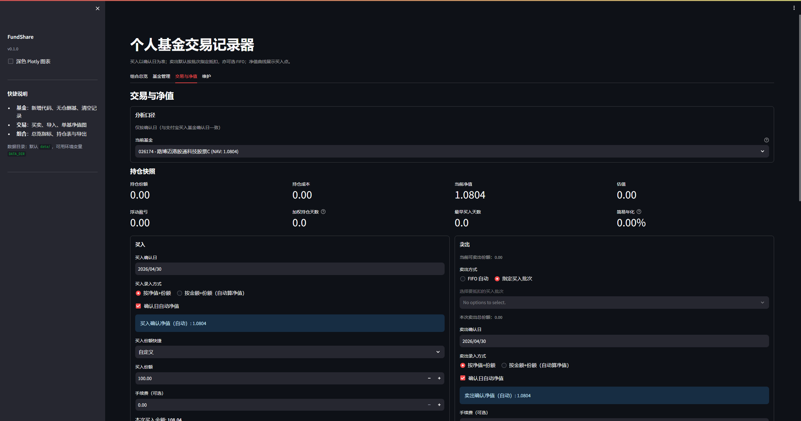

# Personal Fund Trade Recorder

可本地运行的场外基金买卖记录工具：FIFO 抵扣份额、净值曲线、持仓与组合级收益总览，数据保存在本机 JSON（含轮转备份）。

## 界面预览



## 面向使用者（快速上手）

1. 安装依赖：`pip install -r requirements.txt`
2. 启动：`streamlit run app.py`，浏览器打开提示的地址（常见为 `http://localhost:8501`）。
3. 顶部可看到**组合总成本 / 总市值 / 浮动盈亏 / 收益率 / 累计买卖金额 / 已实现盈亏**。
4. 四个标签页：
   - **组合总览**：组合 KPI、多基金持仓表、收益率排行（导出入口暂时隐藏）。
   - **基金管理**：仅展示当前持仓基金（基础信息、业绩曲线、买入节点、lot 分布、最近交易摘要）。
   - **交易与净值**：选基金后记录买入/卖出；**界面买入仅填确认日**（与存储字段 `apply_date`/`confirm_date` 同值写入）；卖出默认 **指定买入批次（lot）**，亦可切换 **FIFO 自动**；买卖均支持“按净值+份额 / 按金额+份额”录入；支持日期筛选与净值图（导出入口暂时隐藏）。
   - **维护**：基金新增、删除基金、删除单条交易、清空单基金记录，并提供“危险操作：一键删除基金及全部记录”。

**大额/清仓卖出**（≥50% 持仓或清仓）需在表单内二次勾选确认。

## Features（摘要）

- 6 位数字基金代码校验；重复代码会提示勿重复添加。
- 界面记录买入以**确认日**为准（申请日与确认日同值）；导入 JSON/CSV 仍可分别提供 `apply_date` 与 `confirm_date`。交易页分析口径为确认日。
- 卖出默认 **指定买入批次（lot）**；亦可 FIFO；手动模式可选择某笔买入并输入要抵扣份额。
- 买卖均支持“按净值+份额 / 按金额+份额（自动算净值）”两种录入模式。
- 每笔卖出可记录 allocations（分摊到 buy_tx_id + shares），支持追溯每次卖出来源买入。
- 净值曲线支持买入点同日聚合（显示当日买入笔数），可切换显示卖出点；清仓买入点以空心样式显示。
- 区间选择位于图下方并居中；若所选区间超出基金可用历史，会显示提示并回退到可用区间。
- 净值图 y 轴按约 4% 步进打格，买入点 hover 字体增强以提升可读性。
- 维护页基金列表显示从 1 开始的展示序号（仅用于 UI 展示，不影响真实 ID）。
- 维护页危险操作区支持输入 `DELETE` 一键删除基金及全部记录（基金本体 + 交易 + 净值点）。
- 所有表格内容统一左对齐，金额类按两位小数展示（基金净值仍保留四位）。
- 数据文件：`data/store.json`；同目录 `store.json.bak` 与 `data/backups/` 下保留最近若干份轮转备份（详见 `.gitignore`，勿把本地数据提交到仓库）。

## Tech Stack

Python · Streamlit · Plotly · Pandas · Requests · pytest / pytest-cov

## Android 本地客户端（实验）

分支 `feature/android-local` 使用 Chaquopy 在设备上嵌入 Python 并复用 `fundshare` 业务包（预研界面，功能未与网页完全对齐）。构建与 MIUI 说明见 [README_ANDROID.md](README_ANDROID.md)，对照表见 [ANDROID_PARITY.md](ANDROID_PARITY.md)。在电脑上实时看界面、用鼠标点击：可用 **Android 模拟器** 或真机 **scrcpy** 投屏（文档内有步骤与 `scripts/scrcpy_preview.ps1`）。

## Run Locally

- Windows PowerShell：`python -m venv .venv` → `.venv\Scripts\Activate.ps1`
- `pip install -r requirements.txt`
- `streamlit run app.py`

## 批量导入 JSON 格式

根对象需包含 `fund_code`（6 位）与 `transactions` 数组。每条交易：

- `tx_type`: `buy` 或 `sell`
- `apply_date` / `confirm_date`: `YYYY-MM-DD`
- `price` / `shares`: 数字
- 卖出交易可选 `allocations`（数组），元素结构：`{"buy_tx_id": 1, "shares": 5.0}`

导入示例下载入口暂时隐藏，可直接按示例结构粘贴内容进行导入。

CSV 导入可选列 `allocations_json`（JSON 字符串）；CSV 导出入口暂时隐藏。

## Tests

```bash
python -m pytest -q
python -m pytest --cov=fundshare --cov-report=term-missing -q
```

## FAQ

- **自动净值与当日不一致？** 数据源按「不晚于所选日的最近净值」取值，与部分平台展示可能差一日，可自行改为手动填写。
- **数据丢了？** 优先查看 `data/backups/` 下时间戳文件或 `store.json.bak`；主文件损坏时会尝试从 `.bak` 自动恢复。
- **端口占用？** Streamlit 可能使用 8502 等备用端口，以终端输出为准。

## 发布前自检

仓库提供 `scripts/verify.ps1`（运行测试 + 覆盖率），详见该脚本说明。
